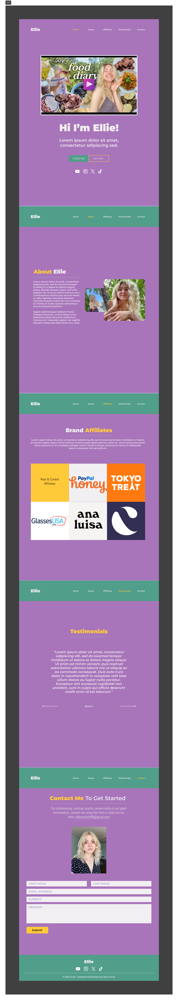
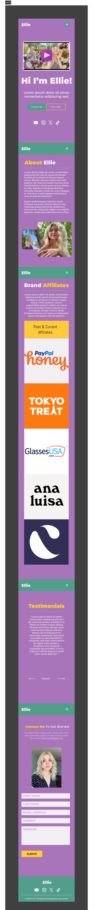

<h2 align="center">
  Ellie Smith Portfolio Website 
  <a href="https://ellie-smith-portfolio.vercel.app/" target="_blank">ellie-smith-portfolio.vercel.app</a>
</h2>

  

 

## About The Project

  

#### Duration
- July - December 2023

 

*A responsive influencer portfolio website for [Ellie Smith](https://www.youtube.com/@elliedee5221).*

Showcasing her featured content, social media links and brands/affiliates she's currently working with and has worked with in the past.

## Built With

This front-end project was built using these technologies:
- React.js 
- Tailwind CSS 
- Framer-Motion
- React Hook Form
- Nuka Carousel
- VS Code
- Vercel
- Figma

## Features

**📱 Fully Responsive**

**📜 Smooth Scrolling with Framer Motion**

**🎨 Styled with Tailwind CSS**

## Prerequisites

To clone this repository, you will need `Node.js` and `git` installed globally on your computer.

## Installation and Setup

1. Installation: `npm install`

2. Move into the project directory: `cd ellie-smith-portfolio`

3. In the project directory, run: `npm start`

This will run the app in the development mode.\
Open [http://localhost:3000](http://localhost:3000) to view the web page in the browser.

## Overview

In the content space, one of the main problems influencers face when having correspondence with brands and affiliates, is having (or lack thereof) a professional space to showcase their past work experience, brands they've worked with and testimonials as a result of submitting their deliverables. Here in this project, I set out to work with a succesful influencer (amassing 100k subs on YouTube plus more followers in other spaces) in designing, implementing and deploying a single-page responsive influencer portfolio site - which they could send to brands when they reach out.

## Design Process

#### Key Skills
- UI/UX, Web Design

For the design process, I conducted remote interviews via FaceTime and Discord over the course of 8 weeks; as my client is based in the US. After intial discussions, I produced a moodboard on Figma, with my client's and own ideas of what the typography, colour scheme and design language should be. Having a clear identity on what the end-product should turn out, and constant collaboration with my client - who is a part of the creative industry - allowed me to showcase my project management and communication skills.   

As a result of having a clear and strong design foundation of this project, I was able to jump ahead and create High Fidelity wireframes on Figma. After designing the desktop wireframes, I was able to easily design the tablet and, subsequently, the mobile wireframes. This was due to having the ability to reuse colour pallets and components I had built already during the design of the desktop wireframes, for example: the social media icons components.  

Hence, I was able to design a prototype that met my client's requirements, as well as give myself (now as a developer) a roadmap to be able to measure my progress in developing this project.

### Moodboard

### Wireframes

#### Desktop

    

#### Tablet

    

#### Phone

    

### What I’ve Learned

This was my first time using Figma to design a website from scratch. So it was also my first time creating components and creating colour pallets within Figma. Prior to this,  I had done some prototyping and wireframing in my first year of university beforehand. But I used a different software and it was very finicky.  

This was the first instance where it all clicked, and why prototyping is very useful. Figma definitely contributed to this. 

### Problems Encountered

Learning how to moodboard and wireframe in Figma came with many challenges. For one, I had problems navigating the interface. And figuring out screensizes for desktop, tablet and mobile view, was an even bigger problem than it needed to be. However, once I found the 'Frame' tool, everything was pretty much smooth sailing.

### Future Directions

Since this was my first time using Figma, I feel like I could have made different design choices - had I known how to use Figma already. Therefore, I definitely could have utilised Figma's export feature and learn how to create components there and be able to export it directly into my development environment. 

## Development Process

#### Key Skills
- Front-End Development

The development process was smooth, for the most part - but took way longer than expected. I had a clear vision of what the end-product should look like- and its functionality. But I procrastinated in starting the actual coding of the website, as I felt a little overwhelemed with the amount of features I had to implement. Therefore, using a Kanban Board, via Jira Software, definitely helped with breaking massive tasks into smaller and manageable pieces,that I was able to easily implement. Moving stories from one section of the board to another, felt very satisfying and helped keep track of the development process.   

### Kanban Board

### What I’ve Learned

Using React.js made sense for this single-page website. I also put an emphasis on organisation, so my hooks were under one directory, my components where under a separate directory, etc.. In turn, I've learned and applied React programming best practices during the development of this project.  

This was my first time using Framer Motion and React Smooth Scrolling. In my opinion, this enhanced the user experience of interacting with the website, and as a developer it was very easy to add animations and smooth scroll. Like Tailwind CSS, I will continue to use this in future projects involving any portfolios and beyond.   

### Problems Encountered

This was my second experience building a project with Tailwind CSS and my (lack of) experience shows. It was tough to set up Tailwind at the start, after creating the react app. But it was definitely worth it, as I was able to debug styling bugs much easier, compared to if all styles where under one singular CSS file; and I was able to easily create responsive CSS styles.  

However, there two main issues that I have yet to resolve. One of them being in the 'Affiliates' page, when the website is in tablet or mobile view, the grid pop-up information's text seems to overflow out of the box it was supposed to be contained under. And I haven't figured out how to solve this.  

The other issue is the footer. It was supposed to have the social media icons component (as seen in the wireframes), that was used in the home/landing page, in the footer itself. Since I created this component for the intention of re-use within the project. It made sense for me to just add the component into the footer and leave it at that. However, when I did such thing, the component was too large for the footer and it would create problems in the positioning of the other elements.  

### Future Directions

Other than fixing the styling issues, I would improve on two other aspects of this current iteration of the website:

- Contact Form: I could add a back-end to this project and handle user form data myself instead of using 'React Hook Form'.
- Testimonial Carousel: Either change the styling of the component and make it match the intended design based on the wireframes. Or I could design and implement the testimonial carousel myself, from scratch.

#### Update (25th NOV 2023)

- Added social media icons component to footer

#### Update (11th DEC 2023)

- Updated about section bio, and home page subheading.
- Updated favicons

## Credits

Joe Groves

